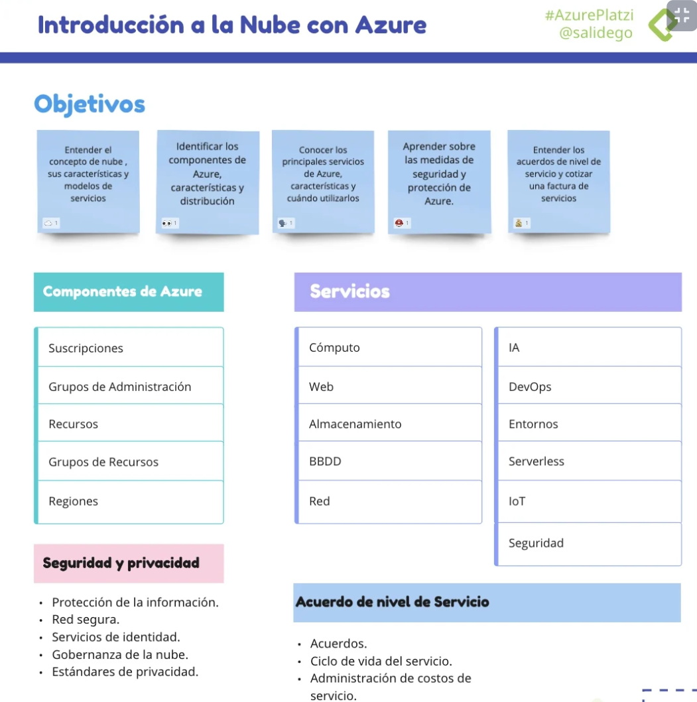
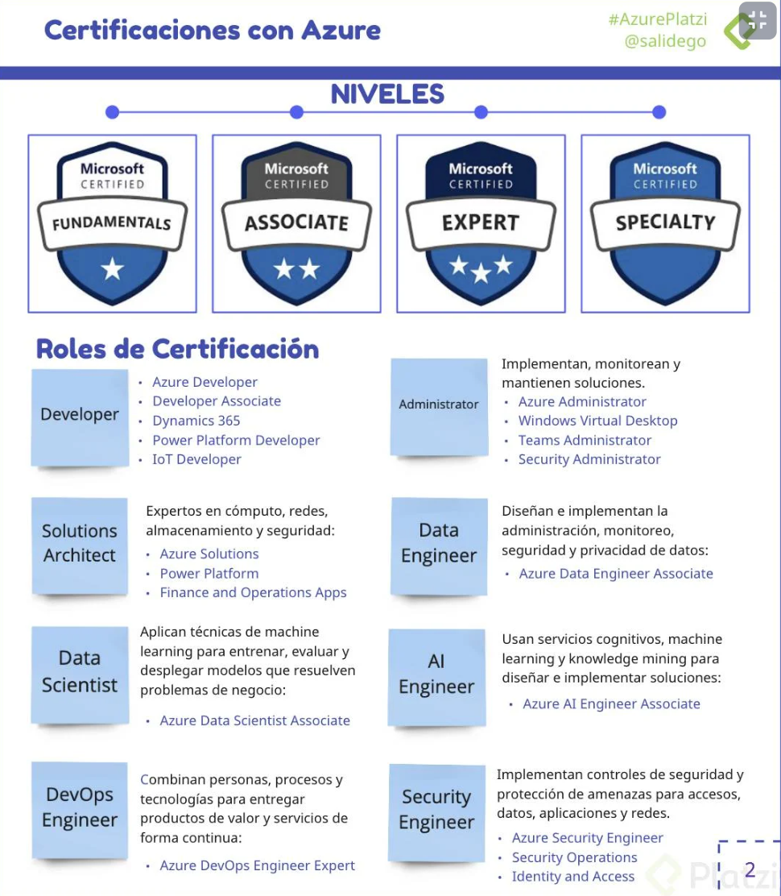

# Nube con Azure

- Aprende Microsoft Azure para escalar tus proyectos en la nube con servicios de DevOps, machine learning, inteligencia artificial, Big Data y espacios de almacenamiento ilimitado. Descubre qué es el cloud computing y cuáles son sus ventajas contra el cómputo on-premise. Domina los conceptos esenciales para crear tu primer instancia de una máquina virtual y especializarte con Azure.

 - Iniciar tu camino para convertirte en especialista de Microsoft Azure
 - Identificar los sistemas de Azure para Inteligencia Artificial y Big Data
 - Conocer los servicios de Azure para Cloud Computing
 - Comprender qué es y para qué sirve el cómputo en la nube
## Microsoft Certifications
https://learn.microsoft.com/en-us/certifications

## Qué es la nube: ventajas y características
### ¿Qué es la nube?
La nube son instalaciones en las cuales cada una tiene de forma independiente energia electrica, refrigeración y seguridad, son llamados Centro de Datos. Dentro de ellos se encuentran cientos de equipos conectados a Internet para consumir los servicios ofrecidos en la Nube.
Los Centros de Datos se encuentran distribuidos a lo largo del mundo. Azure es el servicio Cloud que tiene mas DataCenters desplegados a nivel mundial.
Azure (Microsoft) busca que sus DataCenters sean 100% sustentables utilizando Energias Limpias
### ¿Para qué o Por qué?
- Cómputo
- Servidores
- Almacenamiento y bases de datos
- Redes
- Inteligencia Artificial
- Software y mas
>“Todo lo que puedes hacer en una computadora se puede hacer en la nube pero más: barato, ágil y seguro”
### Modelo basado en consumo
- Pago por servicios usados:
- Reduce costos operativos
- Optimiza la infraestructura
- Escala según las necesidades
- CapEx vs OpEx
  - **Gastos de capital (CapEx):** Inversión en infraestructura física, deducible a largo plazo
  - **Gastos operativos (OpEx):** Inversión en servicios o productos facturados al momento
- Ventajas
  - Confiabilidad y Alta Disponibilidad
    - Experiencia de usuario sin tiempo de inactividad perceptible, aunque haya errores
  - Escalable
    - Vertical: aumentando RAM | CPU a una VM
    - Horizontal: aumentado instancias de recursos
  - Elasticidad
    - Las aplicaciones siempre tendrán los recursos necesarios
  - Agilidad
    - Instanciar recursos en la nube es muy rápido de implementar y configurar
  - Distribución geográfica
    - DataCenter en todo el mundo ofreciendo el mejor rendimiento a cada región
  - Recuperación ante desastres
    - Los datos se protegen con copias de seguridad, replicación de datos y distribución geográfica

## Modelos de servicio: IaaS, PaaS, SaaS y serverless

### On-Premise (Local)
 - Todo corre por tu cuenta:
 - Equipos
 - Adecuación
 - Mantenimiento
 - Configuración
 - Actualización

### IaaS (Infraestrure as a Service)
- Ventajas
 - Parecedo a on-premise ofreciendo mayor flexibilidad y control sobre el hardware:
 - Sin CapEx
 - Ágil
 - Administración compartida
- Desventajas
 - Complicado al inicio según el grado de detalle que se requiere en aspectos de conocimiento y tiempo

### PaaS (Platform as a Services)
- Ventajas
 - Entorno administrado por el proveedor: VMs, red, infraestructura.
 - Solo te preocupas por el desarrollo.
 - Configuración más ágil que IaaS.
 - Enfocado al despliegue de aplicaciones.

- Desventajas
 - Puede ser más caro que IaaS.
 - Compatibilidad con algunos elementos.
 - Dependencias con el proveedor.
 - Riesgos de seguridad.
 - Limitantes de idioma, interfaz o recursos.

### SaaS (Software as a Services)
- Ventajas
 - El proveedor administra el 100% del entorno y los usuarios solo utilizan la aplicación que se ejecuta en la nube:
 - Office Online.
 - Outlook.
 - CRM.
 - ERP.
- Desventajas
 - Se necesita conexión a internet.
 - Poco control.
 - Baja personalización.
 - Desempeño limitado.

### Serveless (Sin servidor landas)
- Sí usa servidores.
- El proveedor aprovisiona, escala y administra la infraestructura.
- Ejecuta funciones o fracciones de código.
- Es dirigida por eventos.

- Ventajas
 - Altamente escalable.
 - Enfocada a la lógica de negocio.
 - Ahorro de tiempo.
 - Desarrollo ágil.
 - Pago por uso.

- Desventajas
 - No están diseñada para procesos extensos.
 - Detalles de desempeño.
 - Retos de testing y debugging.